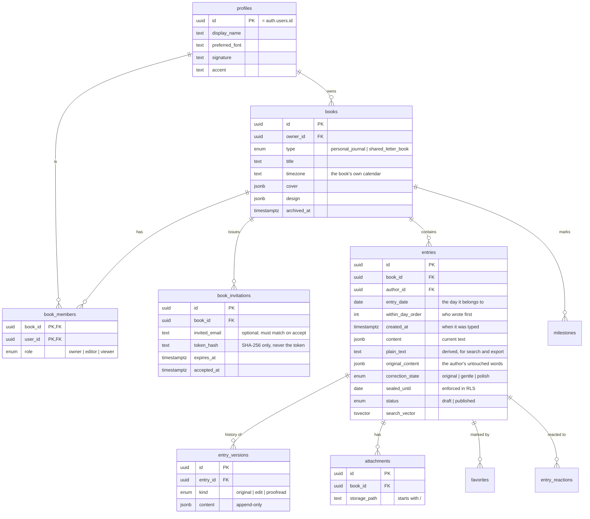

# Journal &amp; Letter

A private place to write letters and journals that quietly compile themselves
into a book.

Write to yourself, or to someone far away. Every entry is filed under the day it
belongs to, with its author and its date, until years of writing can be read —
and printed — as one continuous book.

The application works equally as:

1. A private personal journal.
2. A shared letter book between two people.
3. A shared journal between several invited people.
4. Several independent books belonging to the same account.
5. A source for a properly typeset, printable PDF or Word document.

The central metaphor is a **book**, not a messaging app. There are no chat
bubbles anywhere in it.

---

## Contents

- [What it does](#what-it-does)
- [Architecture](#architecture)
- [Data model](#data-model)
- [Security model](#security-model)
- [Local setup](#local-setup)
- [Supabase setup](#supabase-setup)
- [Google sign-in setup](#google-sign-in-setup)
- [Google Docs export setup](#google-docs-export-setup)
- [AI proofreading setup](#ai-proofreading-setup)
- [Environment variables](#environment-variables)
- [Running the tests](#running-the-tests)
- [Deploying to Vercel](#deploying-to-vercel)
- [Export architecture](#export-architecture)
- [Design decisions worth knowing](#design-decisions-worth-knowing)
- [Known limitations](#known-limitations)
- [Roadmap](#roadmap)

---

## What it does

**Books.** After signing in you see your Library: a shelf of book covers. A book
is either a *personal journal* (only you) or a *shared letter book* (you and the
people you invite). You can have as many as you like.

**Entries on any date.** Every piece of writing has an `entry_date` — the day it
belongs to — kept strictly separate from `created_at`, the moment it was typed.
That is what makes it possible to paste in a letter from June while it is
August, and have it appear in June where it belongs.

**Daily compilation.** The book is ordered by date. Within a day, whoever
submitted first appears first. If Murathan writes on the morning of 14 August
and Rosie writes that afternoon, the book shows Murathan then Rosie, under one
date heading, like a page of a printed book.

**Author identity.** Each writer picks a typeface, an optional handwritten
signature and a restrained accent colour. Their name and the date are shown
automatically, whether or not they typed them.

**Reading, calendar, search.** A continuous reading view with dates as chapter
markers and an optional two-page spread; a calendar showing which days have
writing; and full-text search across everything you are allowed to read.

**Photographs on the page.** Pictures are not attachments in a list — they are
placed on the page. Drag one anywhere, resize and rotate it, cut it into a
shape (circle, arch, heart, hexagon, star, torn-edge cut-out), and choose
whether it sits **behind** the writing, **in front** of it, or **in** it with
the text flowing around the cut-out silhouette. Everything works by touch, so a
page can be arranged on a phone. Positions are stored as fractions of the column
width, so a layout made on a phone looks the same on a laptop.

**Preservation.** Optional proofreading fixes obvious mistakes without touching
slang, pet names, mixed languages or repeated letters — and never replaces the
original, which stays recoverable and separately exportable forever. Its default
mode is *spelling only*, and it is enforced mechanically rather than merely
requested: see [AI proofreading](#ai-proofreading-setup).

**Export.** A typeset PDF, a real `.docx`, or a Google Doc, for the whole book or
any date range, printed from either the original writing or the corrected text.

---

## Architecture

| Layer | Choice | Why |
| --- | --- | --- |
| Framework | Next.js 16, App Router | Server Components keep private data on the server; `proxy.ts` refreshes sessions |
| Language | TypeScript, `strict` + `noUncheckedIndexedAccess` | This code handles other people's private writing |
| UI | React 19, Tailwind CSS v4 | CSS-first theming; book typography is data, not class names |
| Database | Supabase Postgres | Row Level Security is the actual authorization layer |
| Auth | Supabase Auth | Email/password and Google, with sessions in httpOnly cookies |
| Editor | TipTap 3 (ProseMirror) | Structured JSON that survives export to print |
| PDF | `@react-pdf/renderer` | Real typesetting, base-14 fonts, no webfont fetch at export time |
| DOCX | `docx` | A genuine Word file that Google Docs imports cleanly |
| Tests | Vitest, Playwright, SQL | Pure logic, browser flows, and the policies themselves |

```
src/
  proxy.ts                  Session refresh + route gate (Next 16 renamed middleware.ts)
  app/
    (auth)/                 Sign in, sign up, password reset
    (app)/                  Everything behind authentication
      library/              The shelf
      books/[bookId]/       home · write · read · calendar · search · members · settings · export
      invitations/[token]/  Accepting an invitation
      settings/profile/     Writing identity, data export
    api/
      entries/autosave/     Frequent saves, no version history
      proofread/            Server-side AI boundary
      export/[format]/      PDF and DOCX
      google/               Docs export OAuth handshake
    auth/callback/          Turns a sign-in link into a session
  components/
    book/                   Cover, day heading, entry block, rich-text renderer
    editor/                 TipTap editor, toolbar, autosave, proofreading review
    export/                 Export options and print preview
    members/ settings/ ui/  Invitations, forms, primitives
  lib/
    supabase/               Browser, server and generated types
    books/ entries/         Queries and server actions
    proofread/              Provider abstraction, prompts, guard rails
    export/                 One document model, three renderers
    design/                 Fonts, presets, accents, covers
    date/                   Calendar-date handling
    text/                   Rich text, diff, applying corrections
supabase/
  migrations/               Schema, RLS, functions, storage, grants
  tests/                    The release-blocking authorization test
tests/                      Vitest unit and integration tests
e2e/                        Playwright
```

---

## Data model



Two column pairs carry most of the product's meaning:

- **`entry_date` vs `created_at`** — the day the writing belongs to, versus the
  moment it was typed. Keeping them apart is what makes historical imports
  first-class rather than a hack.
- **`content` vs `original_content`** — what the book currently shows, versus
  what the author actually wrote. The second is captured before any machine
  correction and is never overwritten.

---

## Security model

The rule the whole design serves:

> Nothing in a book is readable unless you are an accepted member of that book.
> Guessing an id or a URL gets you an empty result set, not content.

**Authorization lives in Postgres, not in the interface.** Every table has Row
Level Security enabled, and every policy is scoped to book membership. If the
entire `src/` directory were deleted and someone queried the database directly
with the publishable key, they would still get nothing.

**There is no service-role key anywhere in this application.** Not in the code,
not in `.env.example`, not on Vercel. Every read and write runs as the signed-in
user, which means RLS is always in force and there is no privileged path that
could accidentally bypass it. This is a deliberate constraint, and it is why
`accept_invitation` is a `SECURITY DEFINER` function rather than a server route
holding an admin key.

**Policy recursion is avoided with definer helpers.** `book_members` is consulted
by almost every policy, including its own, so `is_book_member()`,
`can_write_book()` and `book_role()` are `SECURITY DEFINER` functions with
`search_path` pinned to empty and every name fully qualified. `EXECUTE` on them
is revoked from `PUBLIC` and `anon` and granted only to `authenticated`
(see `20260814090400_function_grants.sql`) — RLS policy expressions are evaluated
as the calling role, so those grants are required for the policies to work at
all.

**Invitations are hashed.** The raw token exists only inside the invite URL. The
database stores nothing but its SHA-256 hash, and `accept_invitation(p_token)`
re-hashes the raw token inside Postgres. A leaked database dump therefore
contains no usable invitations. Invitations expire, are single-use, and — when
they name an email — can only be accepted by an account with that address.

**Sealed letters are enforced in the database.** An entry with a future
`sealed_until` is withheld by the `entries` SELECT policy from everyone except
its author. The reading view shows "a sealed letter, opens on…" using
`sealed_entry_previews()`, a function that structurally cannot return the text.

**Drafts are private.** An unpublished entry is visible only to its author, by
policy, not by a filter in a query.

**Storage is private.** `book-media` is not a public bucket. Object paths begin
with the owning book's id and `storage.objects` policies authorize from that
first path segment, so a signed URL is required and only members can obtain one.

**Other measures.** Private routes send `X-Robots-Tag: noindex` and carry
`noindex` metadata; book titles never appear in page metadata; the `next=`
redirect parameter is validated against open redirects; sign-out is POST-only;
rich text is rendered as React elements rather than `dangerouslySetInnerHTML`;
link URLs are protocol-checked in both the editor and the renderer; failed
sign-in and password reset answer identically whether or not the account exists;
database errors are mapped to generic messages so an RLS denial never confirms
that a row exists.

### The release-blocking test

`supabase/tests/rls_authorization_test.sql` becomes the `authenticated` role and
sets the same JWT claims PostgREST sets, then plays out the scenario: User A
keeps a private book, User B goes looking for it. It asserts that User B cannot
read the book, its entries, its attachments, its membership or its invitations;
cannot write, edit or delete anything in it; cannot add themselves as a member;
and that after legitimately joining a *different* shared book they still cannot
reach the private one, and still cannot read a sealed letter. Anonymous access
is checked too.

Run it against any environment — it rolls back, so nothing is left behind:

```bash
psql "$DATABASE_URL" -f supabase/tests/rls_authorization_test.sql
```

Every row of the final result must show `passed = true`.

---

## Local setup

Requires Node 20 or newer (developed on Node 24).

```bash
git clone https://github.com/Murathanx12/Journal-Letter-.git
cd Journal-Letter-
npm install
cp .env.example .env.local   # then fill it in — see below
npm run dev
```

Open <http://localhost:3000>.

> **A note on `npm install`.** This project ships an `.npmrc` setting
> `legacy-peer-deps=true`. npm's peer resolver backtracks pathologically on this
> dependency set (Next 16 + ESLint 9 + TipTap 3 + the Vitest toolchain) and does
> not terminate. Every peer actually relied upon — notably `@tiptap/pm` — is
> listed explicitly in `package.json`, so nothing is silently missing.

> **A note on the folder name.** Do not put this project in a path containing an
> `&` character. npm on Windows builds a `PATH` that `cmd.exe` splits at the
> ampersand, and every `npm run` script fails with
> `'…\node_modules\.bin\' is not recognized`.

---

## Supabase setup

1. Create a project at <https://supabase.com>.
2. Apply the migrations in `supabase/migrations/`, in filename order. Either:
   - **Supabase CLI:** `supabase link --project-ref <ref> && supabase db push`
   - **Studio:** paste each file into the SQL Editor and run them in order.
3. Copy **Project URL** and the **publishable key** from
   *Project Settings → API* into `.env.local`.
4. Set the redirect URLs in *Authentication → URL Configuration*:
   - Site URL: your production URL
   - Additional redirect URLs: `http://localhost:3000/auth/callback` and
     `https://<your-domain>/auth/callback`

The migrations create the schema, all RLS policies, the authorization helpers,
the invitation functions, the private `book-media` storage bucket and its
policies, and the least-privilege `EXECUTE` grants.

To regenerate the TypeScript types after a schema change:

```bash
supabase gen types typescript --project-id <ref> --schema public \
  > src/lib/supabase/database.types.ts
```

---

## Google sign-in setup

1. Google Cloud Console → *APIs & Services* → *Credentials* → *Create OAuth
   client ID* → **Web application**.
2. Authorised redirect URI:
   `https://<your-project-ref>.supabase.co/auth/v1/callback`
3. In Supabase → *Authentication → Providers → Google*, paste the client ID and
   secret.

No environment variable is needed in this application — Supabase holds those
credentials. Sign-in requests only `email profile`; it never asks for Drive
access.

---

## Google Docs export setup

This uses a **separate** OAuth client from sign-in, on purpose: signing in should
not ask anybody for access to their Google Drive. Drive permission is requested
only when someone chooses "Create a Google Doc".

1. Enable the **Google Drive API** on your Google Cloud project.
2. Create a second OAuth client ID (Web application).
3. Authorised redirect URI: `<NEXT_PUBLIC_SITE_URL>/api/google/callback`
4. Set `GOOGLE_DOCS_CLIENT_ID` and `GOOGLE_DOCS_CLIENT_SECRET`.

Requested scope: `drive.file` only — access to files this application creates,
and nothing else. It cannot read an existing Drive. The token is requested with
`access_type=online`, used once, and never stored; there is no refresh token.

If these are not configured, the export screen says so plainly and points at the
`.docx` download, which Google Docs imports cleanly.

---

## AI proofreading setup

Set `ANTHROPIC_API_KEY` (and optionally `PROOFREAD_MODEL`, default
`claude-sonnet-5`). Without it, the proofreading button does not appear and the
API route returns 503 rather than pretending to work.

The key is read only on the server. Entry text is sent to the provider **only**
when a person presses the button — there is no background pass over anybody's
journal, and no telemetry contains journal contents.

`src/lib/proofread/` is a provider abstraction: `types.ts` defines the boundary,
`prompts.ts` holds the instructions, `filter.ts` holds the guard rails, and
`anthropic-provider.ts` is one implementation. Adding another provider means
writing one more class.

**The guard rails matter more than the prompt.** The prompt asks the model to
preserve slang, pet names, mixed languages and repeated letters.
`spelling-guard.ts` assumes it sometimes will not.

In the default **spelling only** mode, every individual change must be provably
typographical before a human is even shown it:

| Allowed | Rejected |
| --- | --- |
| the same word respelled within one or two edits (`recieve` → `receive`, `teh` → `the`) | a word swapped for a *different* word |
| case or surrounding punctuation (`i` → `I`, `askim` → `askim,`) | a word inserted that was never written |
| a doubled word removed (`the the` → `the`) | a word removed that was not a duplicate |
| a word split or joined (`goodmorning` → `good morning`) | anything reordered |

One disallowed change rejects the whole paragraph. So

```
"I love you sooo much askim"  →  "I love you very much, my darling."
```

never reaches the review screen.

**This is also how the multilingual promise is kept.** The rule is about the
*shape* of the change, not a dictionary. A word the model does not recognise
cannot be translated or substituted, because the replacement would never be a
near-neighbour of the original — `seni cok seviyorum` cannot become `I love you`.
Turkish, invented spellings and pet names survive untouched, while a genuine
typo inside them (`gunaydni` → `gunaydin`) is still fixable. Distance is
Damerau–Levenshtein over code points, so a transposition costs one edit and
accented or non-Latin characters count as one character each.

**Polish** is the separate, explicitly-chosen mode that may reword. It is bounded
too, but far more loosely. All of this is pinned by tests in
`tests/preservation.test.ts`.

---

## Environment variables

See `.env.example`. Names only, never values.

| Variable | Required | Purpose |
| --- | --- | --- |
| `NEXT_PUBLIC_SUPABASE_URL` | yes | Supabase project URL |
| `NEXT_PUBLIC_SUPABASE_PUBLISHABLE_KEY` | yes | Publishable key; powerless without a session |
| `NEXT_PUBLIC_SITE_URL` | production | Builds email, OAuth and invitation links |
| `ANTHROPIC_API_KEY` | optional | Enables AI proofreading |
| `PROOFREAD_MODEL` | optional | Defaults to `claude-sonnet-5` |
| `GOOGLE_DOCS_CLIENT_ID` | optional | Enables Google Docs export |
| `GOOGLE_DOCS_CLIENT_SECRET` | optional | Enables Google Docs export |

There is deliberately **no** `SUPABASE_SERVICE_ROLE_KEY`. Nothing in this
application needs one.

---

## Running the tests

```bash
npm run lint        # ESLint, including the React Compiler rules
npm run typecheck   # tsc --noEmit
npm test            # Vitest
npm run test:e2e    # Playwright (needs: npx playwright install chromium)
npm run verify      # lint + typecheck + test + production build
```

`npm test` covers:

- **`compile.test.ts`** — daily compilation and ordering: whoever submits first
  appears first; ties fall back to creation time then to a stable key;
  backdated imports file under their own date; manual reordering renumbers a
  day; sealed letters open on the right day.
- **`calendar-date.test.ts`** — timezone correctness, including that Hong Kong
  and London get different calendar days at the same instant, and that
  formatting never shifts a date backwards.
- **`preservation.test.ts`** — proofreading guard rails, word-level diffing, and
  that applying a correction refuses to overwrite a paragraph edited since the
  check ran.
- **`rich-text.test.ts`** — plain-text derivation, pasted-letter import, and the
  export block model.
- **`export.test.ts`** — actually renders a PDF and a DOCX and checks the file
  signatures, across all four page sizes.
- **`security.test.ts`** — open-redirect protection, invitation token entropy
  and hash agreement with Postgres, and settings parsing against malformed data.

The database authorization tests live in
`supabase/tests/rls_authorization_test.sql` — see
[the release-blocking test](#the-release-blocking-test).

---

## Deploying to Vercel

```bash
vercel link
vercel env add NEXT_PUBLIC_SUPABASE_URL production
vercel env add NEXT_PUBLIC_SUPABASE_PUBLISHABLE_KEY production
vercel env add NEXT_PUBLIC_SITE_URL production
# optional
vercel env add ANTHROPIC_API_KEY production
vercel env add GOOGLE_DOCS_CLIENT_ID production
vercel env add GOOGLE_DOCS_CLIENT_SECRET production

vercel deploy          # preview
vercel deploy --prod   # production
```

After the first production deploy, set `NEXT_PUBLIC_SITE_URL` to the real domain
and add `https://<domain>/auth/callback` to the Supabase redirect allow-list, or
sign-in emails will point at the wrong host.

Export routes run on the Node runtime with `maxDuration = 60`, which is enough
to typeset a large book.

---

## Export architecture

The book is compiled **once** into a neutral document model
(`src/lib/export/document.ts`), and PDF, DOCX and Google Docs are dumb renderers
over it. If the PDF and the Word file ever disagreed about what the book says,
the bug would be in one place rather than three.

```
entries (rich text JSON)
        │
        ▼
compileBookForExport()      ← applies the date range and original/current choice
        │
        ▼
ExportDocument              ← days → entries → blocks → runs
        ├──────────────► renderBookPdf()   → typeset PDF
        ├──────────────► renderBookDocx()  → real .docx
        └──────────────► Drive upload of the .docx, converted to a Google Doc
```

The PDF uses only the PDF base-14 fonts (Times, Helvetica, Courier), mapped from
each book's chosen typeface. That is a deliberate trade: nothing is embedded, so
exports are small and fast and a ten-year book never fails to generate because a
webfont could not be fetched. Layout — margins, leading, dates as chapter
headings, indented paragraphs, page numbers, a title page stating whether the
original or corrected text was printed — is what actually makes it read as a
book.

Google Docs export uploads the generated `.docx` and asks Drive to convert it,
rather than assembling hundreds of `documents.batchUpdate` requests. Google's own
importer reproduces the layout far better, and there is one document pipeline to
keep correct instead of two.

This is also the seam for "Order Printed Book" later: a print provider needs a
trim size and a press-ready PDF, both of which come out of `ExportDocument` and
`books.design.pageSize` without touching how entries are stored.

---

## Design decisions worth knowing

**Dates are strings, not instants.** `YYYY-MM-DD` everywhere, with every
conversion to `Date` pinned to UTC. The recurring bug in software like this is
`new Date("2026-08-14")` parsed as UTC midnight and then formatted in a timezone
behind UTC, moving the letter to the 13th. Books carry their own timezone so two
people in different countries agree on which day they are writing.

**`plain_text` is always derived on the server.** A client cannot claim an entry
says something it does not, which matters because `plain_text` is what search
and export read.

**Autosave has two layers.** `localStorage` is written on every change and
survives a crashed tab; the debounced server save is what makes the entry exist
for everybody else. The local copy is cleared only after the server confirms the
same text, so a failed save always leaves something to recover.

**Version history is append-only.** `entry_versions` has no UPDATE or DELETE
policy at all, so history cannot be rewritten with an anon or authenticated key.
Autosave deliberately does not write history — otherwise one letter would
generate hundreds of rows.

**Reading is paginated by day, not by row.** A page boundary must never fall in
the middle of 14 August.

**Author accent is never the only signal.** Names are always spelled out. Colour
and typeface reinforce; they do not carry the information. The same rule governs
the calendar, where contributor dots are accompanied by a screen-reader-only
count.

**404, not 403.** A non-member asking for a book gets `notFound()`, which reveals
nothing about whether that book exists.

---

## Known limitations

- **Images are not embedded in exports.** Photographs upload, store privately,
  and are placed and rendered on the page in the app, but the PDF and DOCX
  render text only. Embedding them requires fetching every signed URL during
  export; the document model already carries the structure for it.
- **No freehand drawing.** Pictures can be placed, masked, rotated and layered,
  but there is no pen tool for drawing on a page.
- **Text follows a photograph's outline, not a curve.** `shape-outside` makes
  the writing flow around a cut-out silhouette, and a placed picture can be set
  at any angle — but text itself cannot yet be set along a curved path, which
  needs SVG `textPath` and a different editor model.
- **Bulk WhatsApp import is server-side only.** `bulkImportEntries` accepts a
  reviewed list of dated entries, and "Add Past Entry" is fully built, but the
  screen that parses a raw WhatsApp export and lets you correct the detected
  dates before importing is not built yet.
- **No simultaneous editing.** Two people editing the *same* entry at once is not
  supported; only the author can edit their own entry, which makes the collision
  rare. Realtime updates for a shared book are not wired up yet.
- **Milestones and reactions exist in the schema** with full policies, but have
  no UI yet.
- **Account deletion is documented, not automated.** Books are deleted
  individually. Deleting an account in a product holding *shared* writing needs a
  deliberate decision about what happens to letters other people are still
  reading.
- **`legacy-peer-deps`** is required; see [Local setup](#local-setup).

---

## Roadmap

**Next**

- Bulk WhatsApp export parser with a review screen before import
- Photographs embedded in PDF and DOCX exports
- Freehand drawing on a page, and text set along a curve
- Supabase Realtime, so a shared book updates when the other person posts

**Later**

- "Order Printed Book": trim size, paper, cover, press-ready PDF
- Milestones and gentle reactions in the reading view
- Memory map from optional per-entry location
- Favourites collection — "Our Favourite Letters"

---

## Product principles

1. This is a book, not chat.
2. Writing is the centrepiece.
3. Preserve the author's authentic words.
4. AI assists; it does not replace the writer.
5. The original text must remain recoverable.
6. Dates and authors are preserved automatically.
7. Historical entries are first-class.
8. Private really means private.
9. Sharing is invitation-based, not public-link publishing.
10. Export must eventually produce something worth keeping for decades.
